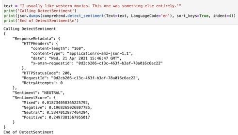
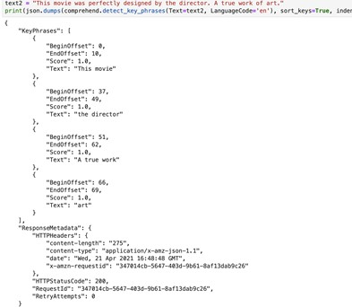
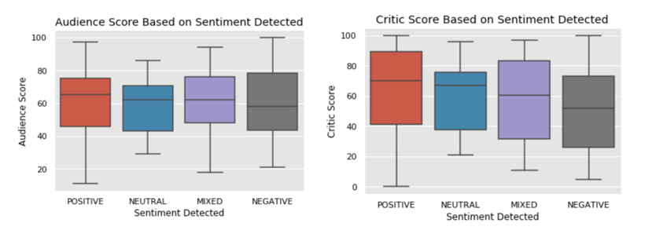
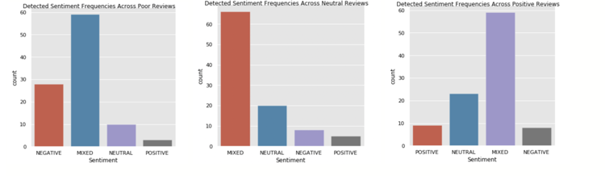
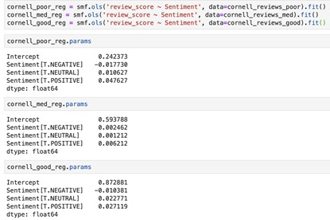

## Motivation

An essential to the classic American summer, we all love to visit the movies. However, when deciding which movie to watch, we are bombarded with out of context reviews and rhetoric that makes it difficult to determine the true quality of a movie. It is common to read reviews from sources such as [Rotten Tomatoes](https://www.rottentomatoes.com/) and [Metacritic](https://www.metacritic.com/), but there are often discrepancies between how critic receive a movie and consumer sentiment. In this post, we use Amazon Comprehend to analyze sentiment in movie reviews, and how the detected sentiment lines up with the movie’s actual rating. We begin with an overview of Amazon Comprehend, explain how our analysis was conducted, and detail our results on the accuracy of the service.

## Amazon Comprehend
As movie consumers, we tend to differ to the experts when it comes to reviews. We can rate the movie from 1-10, “good” or “bad”, but leave the deep analytics to those who are paid to do it. We often count on these reviews as suggestions for movies we should, and should not, see, just as production companies rely on them for publicity. However, professional reviews can be difficult to interpret for the average movie-goer, with involved analysis and rhetoric that sometimes leave us wondering what the writer actually believes. In situations like these, Amazon Comprehend is used to detect the sentiment of the author.
Amazon Comprehend is natural-language processing (NLP) service in Amazon Web Services (AWS) used to discover information in unstructured data. Comprehend uses machine learning to reveal unseen data, as opposed to the tedious task of manually sifting through documents. The service detects identifiable elements in the data, such as references to places, events, or people, and files can be categorized by topic prior to analysis. Even after locating any personally identifiable information, Comprehend masks and redacts this information to ensure security. It is fully managed in AWS, so there is no need create models. The [documentation for AWS Comprehend can be found here](https://docs.aws.amazon.com/comprehend/latest/dg/comprehend-dg.pdf).\

Comprehend receives a text file and sifts through words and phrases to analyze the author’s intentions. The service provides Amazon’s Keyphrase Extraction, Sentiment Analysis, Entity Recognition, Topic Modeling, and Language Detection APIs, which can all be run from the user’s application. Just call the API with the source document’s location, and the APIs will output sentiment, key words, and entities. For example, we used the Sentiment Analysis API, DetectSentiment in our analysis of reviews, which returns the overall sentiment of the text input. After analyzing key phrases in the text, this API identifies the overall sentiment, along with its corresponding confidence score. In the example below, we see an overall sentiment of neutral for the text input. This is a correct interpretation of the text, as the author (us) did not take a firm stance on this movie. The overall sentiment is returned from the confidence scores below it, which tell us how confidence Comprehend is in each sentiment. Here, confidence was split across the board, but neutral has the highest at 53.47%.

 

In addition, as seen below, the Keyphrase Extraction API analyzes the text to detect key phrases that reveal important information about the movie and the author’s feelings. Along with each phrase, the API outputs a confidence score which reflects the API’s confidence that the given phrase is important to analyzing the text.

 
This particular API was not used in our analysis of movie reviews but is an interesting example of Comprehend’s abilities. Not only is Comprehend able to extract individual words, but it can also detect phrases, such as “A true work” above.

## Our Analysis
In this project, we collected written movie reviews, performed sentiment analysis using AWS Comprehend, and then analyzed their accuracy using a variety of statistical techniques. We used two different corpuses of movie reviews specifically designed for sentiment analysis projects: 1) the Cornell Movie Reviews Database, which includes 5006 movie reviews and ratings (0-1) by four different authors, and 2) the Rotten Tomatoes Movies and Critic Reviews dataset, which includes 1,130,017 reviews with "fresh"/"rotten" ratings of 17,712 movies, of which 824,081 reviews contain subjective review scores (e.g. 3/5, B+, etc.). We will explain our analysis below, but for detailed information of our analysis, and the code itself, see our [github repository here](https://github.com/jperelm/QTM350FinalProject/blob/main/Final%20Project.ipynb).

### Rotten Tomatoes Analysis
First, we analyzed 200 critic reviews within the Rotten Tomatoes Movies and Critic Reviews dataset, along with the critic consensus for 200 movies, which is a collective review written by critics about a movie. Since we analyzed only 200 of each review type, we created a subset of the data that contained only the first 200 reviews and consensus. In both circumstances, we extracted the sentiment of the given review or consensus, stored them in a dictionary, extracted them from the dictionary, and then added the sentiments as a new column in the original subset. From here, we were able to visualize and analyze the detected sentiments.

As seen in the box plots below, we see a discrepancy between how Comprehend detects critic review sentiments, and how audiences and critics actually rate these movies.

On the left, we see that audiences tend to score movies rather equally regardless of how Comprehend interprets critic reviews. However, on the right, we see the expected trend. Comprehend’s detected sentiment lines up with critic scores; reviews with positive sentiment have the highest scores and movies with negative sentiment have the lowest scores. From this, we can infer that Comprehend is, on average, detecting the correct sentiment in the critic reviews, as the detected sentiments line up with how critics scored the movie. The difference between Comprehend’s detection and how audiences rated a movie most likely comes from critic and audience differences in movie knowledge. A regular movie goer does not possess the movie knowledge that a critic does, and thus is not able to observe differences in movie qualities. Therefore, audiences rate all movies rather equally.
Additionally, we ran a series of regressions involving Comprehend’s detected sentiment. One of these is seen below.

 
This is a regression of a movie's critic rating (or tomatometer rating) on detected sentiment and the number of top critics who determine the movie's rating. From the positive coefficient on positive sentiment and negative coefficient on negative sentiment, Comprehend is detecting sentiments correctly. Movies with positive detected sentiments, and thus a positive review, result in higher ratings. Also, we see a negative coefficient on the number of top critics who rate a movie. While it is small, it suggests that movies reviewed by a larger number of top-rated critics often have lower ratings. This is most likely because top critics are the hardest to please and often give harsher reviews. They expect the most out of a production, so movies with many top critics reviewing them receive lower scores.
### Cornell Analysis
Next, from the Cornell Movie Reviews Database, we detected the sentiment of 100 poor, medium, and well rated movies (300 total). To do so, we created 3 subsets of the data containing 100 reviews each of the corresponding rating type and stored them in separate data frames. We extracted the sentiment of the given review or consensus, stored them in a dictionary, extracted them from the dictionary, and then added the sentiments as a new column in the original subset.  From here, we were ready for analysis.
The three bar plots below show the frequencies of each detected sentiment in the poor, medium and well rated movies data.

     

Looking at these plots, there is a problem in Comprehend’s detection ability. We do not see a majority of positive sentiments in well rated movie data or a majority of negative sentiments in the poorly rated movie data. Instead, we see a majority of mixed sentiments in all three plots. One possible explanation for this is sympathy from movie reviewers. If a movie is bad, the reviewer will make this known to the reader, but will not want to only point out what the movie does wrong. They will focus on highlights of the film as well, which Comprehend may incorrectly interpret as the reviewer enjoying the movie.

In addition, we ran three regressions from this data. All three are regressions of the review score on detected sentiment, one for each review dataset (poor, medium, good). The results are below.

 
We see very small differences in the coefficients for each detected sentiment within and across regressions. For example, in the third regression, we would expect to see a larger coefficient on positive sentiment than any other coefficient, but this is not the case. The coefficient on positive sentiment is only slightly larger than that of neutral sentiment, suggesting that comprehend detects an equal amount of neutral and positive sentiments, when it should detect mostly positive.
